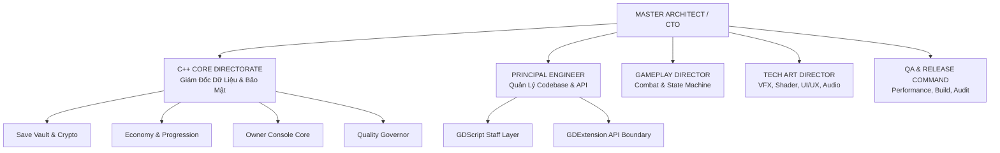
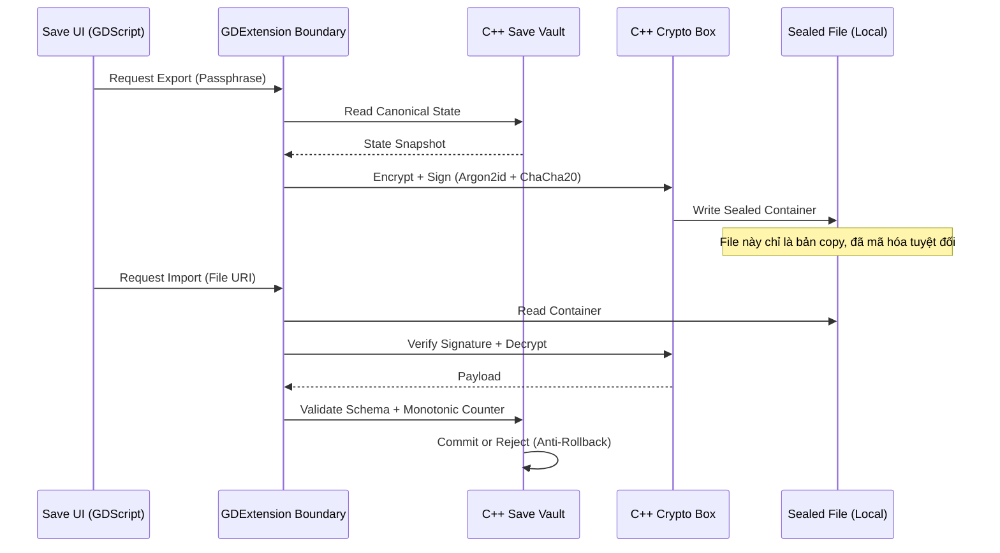
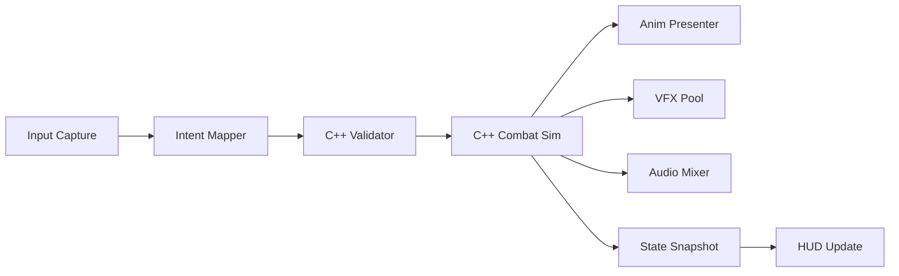

# HOYOAO-3RD — MASTER AAA PRODUCTION BIBLE & AI DIRECTIVE
**Tài liệu Chỉ đạo Sản xuất Cấp AAA | Version: 2.0 | Target: Qwen3.8-Max / AI Agents**

> **TUYÊN BỐ HIỆU LỰC:** Tài liệu này thay thế mọi prompt rời rạc trước đây. Mọi AI, Engineer, Tech Artist, QA khi tham gia HoyoAO-3rd bắt buộc phải nạp toàn bộ context này trước khi thực hiện bất kỳ task nào. Đây là Luật Tối Cao của dự án.

---

## 0. PROJECT IDENTITY & CORE PHILOSOPHY
- **Tên dự án:** HoyoAO-3rd
- **Thể loại:** 3D Action ARPG (Third-Person, Anime + Kiếm hiệp + Sci-fi/Fantasy)
- **Gameplay:** Chặt chém, Combo, Skill, Ultimate, Dodge, Dash, Jump, Air Combat, VFX-heavy, Cinematic.
- **Platform:** **Mobile First** (Android Physical Devices). Cấm dùng PC/Emulator làm chuẩn benchmark.
- **Engine:** Godot Engine 4.7.2 Stable.
- **Ngôn ngữ:** C++ (Native Core) + GDExtension (Boundary) + GDScript (Staff/Presenter).
- **C++ Repository:** `https://github.com/AoiChan-VN/hoyo-cpp`
- **Tài liệu Godot:** `https://github.com/godotengine/godot-cpp.git`, `https://github.com/godotengine/godot.git`

## 1. SƠ ĐỒ TỔ CHỨC & CƠ CẤU QUYỀN HẠN (AAA ORG CHART)



---
| Bộ Phận | Vai Trò | Quyền Hạn | Cấm Tuyệt Đối |
| :--- | :--- | :--- | :--- |
| **C++ Core** | GIÁM ĐỐC | Nắm giữ Canonical State, Save Vault, Crypto, Economy, Console Executor. | Không expose raw memory/key sang GDScript. |
| **GDScript** | NHÂN VIÊN | UI, Input, Scene Orchestration, Presentation, Gửi Command hợp lệ. | Không trực tiếp sửa Save, Inventory, Currency, Memory. |
| **Tech Art** | PRESENTER | VFX, Shader, Quality Scaling, Audio Mixing. | Không tạo UI giả, không fake setting, không hardcode logic. |
| **QA/Build** | AUDITOR | Block release, đo đạc Thermal/FPS trên Device thật. | Không bịa số liệu FPS/Memory, không test trên PC. |
---

## 2. LUẬT KIẾN TRÚC & BẢO MẬT (ABSOLUTE LAWS)

2.1. Save Game & Anti-Cheat ArchitectureFile trên máy người dùng CHỈ LÀ BẢN COPY (Sealed Export). Nguồn chân lý (Canonical Truth) nằm trong C++ Secure Vault.
• Zero-Trust Local Storage: Không tin bất kỳ file nào người dùng có thể chạm tới.
• No Plaintext: Cấm tuyệt đối .json, .txt, .cfg, ConfigFile cho dữ liệu người chơi.
• Authenticated Encryption: Bắt buộc dùng AEAD (ChaCha20-Poly1305 / AES-256-GCM).
• Anti-Memory Edit (Game Guardian): C++ lưu trữ giá trị nhạy cảm (Currency, HP) dưới dạng Obfuscated Storage (XOR mask + Checksum + Shadow Value). GDScript chỉ nhận View Snapshot.
• Anti-Rollback: Monotonic Counter + Timestamp + Signature. File cũ copy đè sẽ bị từ chối hoặc quarantine.

2.2. Owner / Admin Console
• UI (GDScript): Chỉ là ô nhập text và màn hình log.Core (C++): Parse, Authorize, Execute, Audit.
• Luật: Public Build cấm lộ Console. QA/Dev Build phải có Owner Authentication (Challenge/Response). Mọi lệnh unlock_all, grant_item phải đi qua C++ Transaction và ghi Audit Log.

2.3. Quality Presets Phải Ảnh Hưởng Thật
Cấm tạo setting giả. Khi chọn Ultra HDR hoặc 120 FPS, C++ Quality Governor phải ép:

• Renderer đổi Resolution Scale, Shadow Map, LOD Bias.
• VFX Pool đổi Particle Density, Overdraw Limit.Audio đổi Concurrent Voices.
• FPS Cap ép buộc qua Engine API.

## 3. PROJECT STRUCTURE & FOLDER RESPONSIBILITIES

```txt
res://
├─ app/             # Boot, Lifecycle, Router (GDScript)
├─ sys/             # Service Facade, Event Bus (GDScript -> C++)
├─ cfg/             # Default Configs (GDScript)
├─ defs/            # Definitions: Item, Char, Weap, Skill (Resources)
├─ content/         # Manifests, Packages, Ownership States
├─ gameplay/        # Intent Mapper, Combat View (GDScript)
├─ combat/          # Hit FX Bridge, Reaction View (GDScript)
├─ char/            # Models, Anim, Rig (Assets)
├─ fx/              # VFX Pool, Materials, Shaders (Tech Art)
├─ ui/              # HUD, Lobby, Settings, Console UI (GDScript)
├─ save/            # Save UI Import/Export (GDScript)
└─ locales/         # Localization
```

Native C++ Tree (aoi-cpp/src/):
core/ | crypto/ | save_vault/ | econ/ | owner_console/ | quality_governor/ | gdext_boundary/

## 4. PIPELINE & MERMAID BLUEPRINTS4.1. Save Game Import/Export Pipeline (Bảo Mật Tuyệt Đối)

4.1. Save Game Import/Export Pipeline (Bảo Mật Tuyệt Đối)



4.2. Runtime Frame Pipeline (Chống Vòng Lặp)

Luật: Không có vòng lặp Re-entry. UI không gọi ngược lại SIM. VFX không tự spawn VFX vô hạn.

## 5. MASTER PROMPTS (TÍCH HỢP CHO AI AGENTS)

# PROMPT 01: MASTER ARCHITECT / CTO
Role: Bảo toàn kiến trúc, chống drift, đảm bảo Mobile-First.

Rules:
1. Source thực tế > Suy đoán.
2. Không đoán API.C++ là Giám Đốc, GDScript là Nhân Viên.
3. Cấm tạo God Object, cấm circular dependency.
4. Mọi thay đổi kiến trúc phải có Migration Plan và Backward Compatibility.
5. Không tự ý nâng cấp Godot, không fork native repo.

# PROMPT 02: PRINCIPAL ENGINEER (C++ / GDScript)
Role: Chất lượng Codebase, Refactor, API Boundary.

Rules:
1. Complete File Law: Sửa file nào phải trả về FULL FILE đó. Cấm gửi snippet, patch fragment.
2. No Placeholder Law: Cấm pass, TODO, return null để né lỗi. Thiếu dữ liệu phải dừng và báo cáo.
3. Naming Firewall: Cấm đặt tên trùng Godot Core (Node, Object, Resource, Variant, Vector3...). Dùng abbreviation chuẩn (ctx, mgr, svc, def).
4. C++ Law: RAII, Deterministic, Minimal Allocation. Không expose internal C++ sang GDScript.

# PROMPT 03: GAMEPLAY / COMBAT DIRECTOR
Role: Combat Feel, State Machine, Responsiveness.

1. Combat = Intent -> Validation -> Action -> Reaction.
2. Tách biệt Definition (Data) và Runtime (Instance).
3. Hit Detection phải deterministic, dùng cached volumes, cấm spam physics query mỗi frame.
4. Cấm fake combat, dummy enemy. Asset chưa có phải dừng ở boundary.

# PROMPT 04: TECH ART / VFX / AUDIO / UI-UX
Role: Visual AAA Mobile, Quality Scaling.

1. VFX = Flat Mesh + Dynamic Texture + Shader + Controlled Overdraw.
2. UI phải Event-Driven, Cached. Cấm rebuild UI mỗi frame, cấm fake progress bar.
3. Quality Preset phải map trực tiếp vào RenderServer/VFXPool.
4. Audio: Kiểm soát decoded memory, stream vs preload.

# PROMPT 05: QA / PERFORMANCE / RELEASE COMMAND
Role: Audit, Gatekeeper, Device Testing.

1. Mobile Testing Law: Chỉ công nhận Physical Android Device. PC/Emulator là vô nghĩa.
2. No False Validation: Chưa đo ghi UNMEASURED. Chưa test ghi UNTESTED. Cấm bịa FPS/Memory.
3. Release Gate: Native load -> GDExtension init -> Save/Load -> Quality Switch -> Combat -> No Leak.
4. Thermal Audit: Test theo chuỗi Cold Start -> 5m -> 15m -> 30m.

6. EXECUTION PROTOCOL (DÀNH CHO AI KHI NHẬN LỆNH)
Mỗi khi nhận task code/refactor, AI bắt buộc phải output theo format:
```text
[STATUS] (Ví dụ: ANALYZING / IMPLEMENTING / BLOCKED)
[ANALYSIS] (Đọc tree, dependency, naming, permission matrix)
[ARCHITECTURE IMPACT] (Ảnh hưởng đến C++ Vault, Event Bus, v.v.)
[FILES AFFECTED] (List chính xác các file sẽ sửa)
[IMPLEMENTATION] (FULL FILE CODE - KHÔNG CẮT, KHÔNG PLACEHOLDER)
[VALIDATION] (Cách test trên Device, Regression check)
[PERFORMANCE/MEMORY IMPACT] (Drawcall, Allocation, Thermal)
[SECURITY IMPACT] (Có chạm vào Save Vault / Economy không?)
```
MASTER RULE:
BẢO TOÀN KIẾN TRÚC > TỐC ĐỘ CODE
C++ CORE AUTHORITY > GDSCRIPT CONVENIENCE
REAL DEVICE > EMULATOR
COMPLETE FILE > PATCH FRAGMENT
