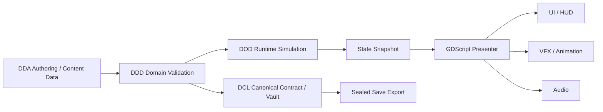

# HOYOAO-3RD — MASTER PROJECT STRUCTURE
## DOD / DDD / DDA / DCL AAA PRODUCTION BLUEPRINT

Version: 1.0  
Target: HoyoAO-3rd  
Engine: Godot 4.7.2 Stable  
Language Stack: C++ Native Core + GDExtension + GDScript Presenter  
Platform: Mobile First — Android Physical Devices  
Reference Repos:
- https://github.com/godotengine/godot.git
- https://github.com/godotengine/godot-cpp.git

---

## 1. DESIGN PHILOSOPHY

Dự án HoyoAO-3rd được thiết kế theo triết lý AAA Action ARPG hiện đại:

1. **C++ là nguồn chân lý**
   - Canonical state nằm trong C++.
   - Save file trên máy người chơi chỉ là sealed export.
   - GDScript không được trực tiếp sửa dữ liệu nhạy cảm.

2. **GDScript là tầng trình diễn**
   - UI.
   - Input.
   - Scene flow.
   - Animation/VFX reaction.
   - Snapshot consumption.

3. **Content-driven architecture**
   - Nhân vật, vũ khí, skill, item, enemy, stage được định nghĩa bằng data.
   - Hạn chế hardcode logic vào scene hoặc UI.
   - Hỗ trợ package/manifest để mở rộng nội dung.

4. **Mobile-first performance**
   - Target device thật Android.
   - Không lấy PC/emulator làm chuẩn.
   - Kiểm soát drawcall, overdraw, memory, thermal.

5. **Security by design**
   - Zero-Trust Local Storage.
   - No plaintext user data.
   - Authenticated encryption.
   - Anti-memory edit.
   - Anti-rollback.

---

## 2. FOUR ARCHITECTURE PILLARS

### 2.1. DCL — Domain Core / Contract Layer

DCL là tầng luật lõi của toàn bộ hệ thống.

Trách nhiệm:

- Định nghĩa canonical schema.
- Định nghĩa command envelope.
- Định nghĩa event contract.
- Định nghĩa ID domain.
- Quản lý secure storage.
- Quản lý crypto envelope.
- Quản lý audit log.
- Quản lý owner authentication.
- Quản lý economy ledger authority.

Nơi đặt DCL:

- C++ Core.
- `aoi-cpp/src/core/`
- `aoi-cpp/src/crypto/`
- `aoi-cpp/src/save_vault/`
- `aoi-cpp/src/gdext_boundary/`

DCL không được:

-Expose raw memory sang GDScript.
-Expose key/material sang GDScript.
-Cho phép GDScript tự ý ghi đè canonical state.
-Cho phép UI sửa trực tiếp economy/save/ownership.

---

### 2.2. DDD — Domain-Driven Design Layer

DDD chia hệ thống thành các bounded context rõ ràng.

Các domain chính:

1. **SaveVaultDomain**
   - Lưu canonical state.
   - Xuất/nhập sealed save.
   - Validate schema.
   - Chống rollback.

2. **EconomyDomain**
   - Currency.
   - Transaction.
   - Grant.
   - Consume.
   - Audit.

3. **OwnershipDomain**
   - Nhân vật sở hữu.
   - Vũ khí sở hữu.
   - Item sở hữu.
   - Package ownership.

4. **ProgressionDomain**
   - Level.
   - Exp.
   - Upgrade.
   - Ascension.
   - Skill unlock.

5. **CombatSimDomain**
   - Intent validation.
   - Skill activation.
   - Combo state.
   - Hit confirmation.
   - Reaction event.

6. **OwnerConsoleDomain**
   - Command parse.
   - Authorization.
   - Execution.
   - Audit.

7. **QualityGovernorDomain**
   - Quality preset authority.
   - FPS cap.
   - Resolution scale.
   - Shadow/LOD/VFX density control.

8. **ContentManifestDomain**
   - Manifest validation.
   - Package mount.
   - Ownership state.
   - Patch readiness.

Nơi đặt DDD:

- C++ domain services:
  - `aoi-cpp/src/save_vault/`
  - `aoi-cpp/src/econ/`
  - `aoi-cpp/src/owner_console/`
  - `aoi-cpp/src/quality_governor/`
  - `aoi-cpp/src/combat_sim/`
  - `aoi-cpp/src/content_domain/`
- Godot resource definitions:
  - `res://defs/`
- Godot service facade:
  - `res://sys/services/`

---

### 2.3. DDA — Data-Driven Assets / Authoring Layer

DDA là tầng nội dung và tài nguyên được authoring bởi designer/artist.

Trách nhiệm:

- Định nghĩa static data.
- Tạo manifest.
- Đóng gói content package.
- Quản lý localization.
- Quản lý quality preset data.
- Cung cấp dữ liệu cho DDD validate và DOD runtime.

DDA không được:

- Chứa runtime mutable state.
- Chứa logic economy authority.
- Chứa save vault.
- Chứa crypto key.
- Ghi đè canonical state.

Nơi đặt DDA:

- `res://defs/`
- `res://content/`
- `res://cfg/`
- `res://locales/`

---

### 2.4. DOD — Data-Oriented Design Runtime Layer

DOD là tầng runtime tối ưu cho game action tần suất cao.

Trách nhiệm:

- Xử lý combat simulation theo data block.
- Dùng pool cho VFX/audio/particle.
- Dùng cached hit volume.
- Dùng snapshot double-buffer.
- Giảm allocation trong frame nóng.
- Đảm bảo deterministic validation.
- Hạn chế spam physics query mỗi frame.

Nơi đặt DOD:

- Gameplay runtime:
  - `res://gameplay/`
- Combat view:
  - `res://combat/`
- VFX pool:
  - `res://fx/`
- C++ simulation:
  - `aoi-cpp/src/combat_sim/`

DOD không được:

- Cho phép UI gọi ngược vào simulation.
- Cho phép VFX tự spawn vô hạn không kiểm soát.
- Cho phép fake combat bằng dummy logic không qua validation.
- Cho phép mỗi frame tạo allocation lớn không cần thiết.

---

## 3. HIGH-LEVEL DATA FLOW


---

Luật một chiều:

- GDScript gửi command/ intent xuống C++.
- C++ validate và tạo snapshot/event.
- GDScript chỉ trình diễn từ snapshot/event.
- UI không gọi ngược vào simulation.
- VFX không tự ý sửa domain state.

---

## 4. GODOT PROJECT STRUCTURE

Cấu trúc dưới đây giữ nguyên các thư mục bắt buộc của Hoyo-Source và mở rộng các thư mục con theo DOD/DDD/DDA/DCL.

```text
res://
├─ app/
│  ├─ boot/
│  ├─ lifecycle/
│  └─ router/
│
├─ sys/
│  ├─ bridge/
│  ├─ commands/
│  ├─ event_bus/
│  ├─ services/
│  └─ telemetry/
│
├─ cfg/
│  ├─ defaults/
│  └─ quality/
│
├─ defs/
│  ├─ characters/
│  ├─ weapons/
│  ├─ skills/
│  ├─ items/
│  ├─ enemies/
│  ├─ stages/
│  ├─ gacha/
│  └─ quality/
│
├─ content/
│  ├─ manifests/
│  ├─ packages/
│  ├─ ownership/
│  └─ patches/
│
├─ gameplay/
│  ├─ intent/
│  ├─ state/
│  ├─ camera/
│  ├─ flow/
│  └─ debug/
│
├─ combat/
│  ├─ view/
│  ├─ hitfx/
│  ├─ reaction/
│  └─ debug/
│
├─ char/
│  ├─ models/
│  ├─ anim/
│  ├─ rig/
│  └─ presets/
│
├─ fx/
│  ├─ vfx_pool/
│  ├─ materials/
│  ├─ shaders/
│  └─ overdraw/
│
├─ ui/
│  ├─ hud/
│  ├─ lobby/
│  ├─ settings/
│  ├─ console/
│  └─ debug/
│
├─ save/
│  ├─ import/
│  ├─ export/
│  └─ quarantine/
│
├─ locales/
│  ├─ en/
│  ├─ vi/
│  └─ zh/
│
├─ docs/
│  └─ architecture/
│
└─ addons/
   └─ aoi_cpp/
      ├─ bin/
      ├─ gdextension/
      └─ aoi_cpp.gdextension
```

## 5. FOLDER RESPONSIBILITIES5.

### 5.1. res://app/

Chứa vòng đời ứng dụng.

- boot/: bootstrap engine, load native core, init service facade.
- lifecycle/: pause/resume/focus/low memory handling.
- router/: scene navigation, flow switch.

Owner: Principal Engineer + CTO.

### 5.2. res://sys/

Service facade và boundary giữa GDScript với C++.

- bridge/: wrapper gọi GDExtension.
- commands/: command envelope từ GDScript xuống C++.
- event_bus/: event từ C++ lên GDScript.
- services/: service facade cho UI/gameplay.
- telemetry/: log runtime, audit view, debug channel.

Owner: Principal Engineer.

Luật:

- sys/ không chứa gameplay logic.
- sys/ không chứa UI layout.
- sys/ không sửa trực tiếp save/economy.

### 5.3. res://cfg/

Config mặc định.

- defaults/: default settings.
- quality/: quality preset mapping.

Owner: Tech Art Director + Principal Engineer.

Luật:
- Config quality phải map thật tới Quality Governor.
- Cấm setting giả.

### 5.4. res://defs/

Definitions cho DDA.

- characters/: definition nhân vật.
- weapons/: definition vũ khí.
- skills/: definition skill/combo.
- items/: definition item.
- enemies/: definition enemy.
- stages/: definition stage/battle context.
- gacha/: definition pool/rule nếu có.
- quality/: definition quality preset.

Owner: Gameplay Director + Principal Engineer + Tech Art.

Luật:

- Definitions là static authored data.
- Không lưu runtime state trong definitions.
- Không đặt tên trùng Godot Core như Node, Object, Resource, Variant.

### 5.5. res://content/

Content package pipeline.

- manifests/: manifest metadata, version, hash.
- packages/: content bundle/package.
- ownership/: ownership state presentation.
- patches/: patch readiness.

Owner: C++ Core Directorate + Principal Engineer.

Luật:
- Manifest phải validate được.
- Ownership state thật phải do C++ xác nhận.
- UI không tự tạo ownership giả.

### 5.6. res://gameplay/

Gameplay presenter và intent mapper.

- intent/: chuyển input thành intent.
- state/: consume snapshot.
- camera/: camera action ARPG.
- flow/: battle flow, exploration flow.
- debug/: debug presenter.

Owner: Gameplay Director.

Luật:
- Gameplay không sửa canonical state.
- Gameplay chỉ gửi intent hợp lệ.
- Gameplay nhận snapshot/event từ C++.

### 5.7. res://combat/

Combat view layer.

- view/: combat presenter.
- hitfx/: hit FX bridge.
- reaction/: reaction animation/hit-stop/knockback view.
- debug/: combat debug overlay.

Owner: Gameplay Director + Tech Art Director.

Luật:
- Combat view không tự tính toán sát thương cuối cùng nếu đã thuộc C++ authority.
- Hit FX phải qua bridge, không tự spawn vô hạn.
- Reaction phải dựa trên combat event/snapshot.

### 5.8. res://char/

Character assets.

- models/
- anim/
- rig/
- presets/

Owner: Tech Art Director.

Luật:

- Asset phải có pipeline import rõ ràng.
- Không hardcode logic domain trong asset scene.

### 5.9. res://fx/

VFX pipeline.

- vfx_pool/
- materials/
- shaders/
- overdraw/

Owner: Tech Art Director.

Luật:

- VFX phải pooled.
- Có overdraw budget.
- Quality Governor có thể giảm particle density.
- Không fake VFX bằng UI nếu không thuộc UI layer.

### 5.10. res://ui/

UI layer.

- hud/
- lobby/
- settings/
- console/
- debug/

Owner: Tech Art Director + Principal Engineer.

Luật:

- UI event-driven.
- UI cached.
- Không rebuild UI mỗi frame.
- Không fake progress bar nếu không có trạng thái thật.
- Owner Console UI chỉ là input/log view, executor nằm ở C++.

### 5.11. res://save/

Save UI import/export.

- import/
- export/
- quarantine/

Owner: C++ Core Directorate + Principal Engineer.

Luật:

- UI không trực tiếp đọc/ghi save plaintext.
- Mọi export/import phải qua C++ Save Vault.
- File bị từ chối có thể được đưa vào quarantine để audit.

### 5.12. res://locales/

Localization.

Owner: Tech Art Director + Content.

Luật:

- Không hardcode text UI trong code.
- Localization phải thuộc DDA.

### 5.13. res://docs/

Tài liệu kiến trúc, pipeline, audit.

Owner: CTO / Master Architect.

### 5.14. res://addons/aoi_cpp/

GDExtension integration.

- bin/: native binary output.
- gdextension/: cấu hình extension nếu cần.
- aoi_cpp.gdextension: Godot GDExtension manifest.

Owner: Principal Engineer + C++ Core Directorate.

Luật:

- Chỉ expose API boundary đã được kiểm soát.
- Không expose internal C++ header hoặc raw pointer tùy tiện.
- API phải đối chiếu với godot-cpp.

## 6. NATIVE C++ PROJECT STRUCTURE
```txt
aoi-cpp/
├─ src/
│  ├─ core/
│  │  ├─ dcl/
│  │  ├─ ids/
│  │  ├─ schema/
│  │  ├─ clock/
│  │  └─ result/
│  │
│  ├─ crypto/
│  │
│  ├─ save_vault/
│  │
│  ├─ econ/
│  │
│  ├─ owner_console/
│  │
│  ├─ quality_governor/
│  │
│  ├─ combat_sim/
│  │
│  ├─ content_domain/
│  │
│  └─ gdext_boundary/
│
├─ third_party/
│  └─ godot-cpp/
│
└─ tests/
```

## 7. NATIVE FOLDER RESPONSIBILITIES

### 7.1. src/core/

Core foundation.

- dcl/: domain contracts.
- ids/: stable ID types.
- schema/: schema validation.
- clock/: time/monotonic counter.
- result/: result/error envelope.

Owner: C++ Core Directorate.

### 7.2. src/crypto/

Crypto envelope.

Trách nhiệm:

- Authenticated encryption.
- Signature.Key wrapping.
- Anti-rollback support.
- Secure random.

Owner: C++ Core Directorate.

Luật:

- Không plaintext dữ liệu nhạy cảm.
- Không đưa key sang GDScript.
- Ưu tiên AEAD.

### 7.3. src/save_vault/

Canonical save vault.

Trách nhiệm:

- Lưu canonical state.
- Validate schema.
- Commit/reject import.
- Anti-rollback.
- Export sealed container.

Owner: C++ Core Directorate.

### 7.4. src/econ/

Economy ledger.

Trách nhiệm:

- Currency balance authority.
- Transaction ledger.
- Grant/consume validation.
- Audit hook.

Owner: C++ Core Directorate.

Luật:

- GDScript chỉ nhận view snapshot.
- Mọi grant_item/unlock_all phải đi qua transaction.

### 7.5. src/owner_console/

Owner console core.

Trách nhiệm:

- Parse command.
- Authorize owner.
- Execute command.
- Audit log.

Owner: C++ Core Directorate.

Luật:

- Public build không lộ console.
- Dev/QA build phải có owner authentication.
- Command nguy hiểm phải audit.

### 7.6. src/quality_governor/

Quality authority.

Trách nhiệm:

- Áp quality preset thật.
- Điều phối FPS cap.
- Điều phối resolution scale.
- Điều phối shadow/LOD/VFX density.

Owner: Tech Art Director + C++ Core Directorate.

Luật:

- Cấm setting giả.
- Preset phải ảnh hưởng thật tới runtime.

### 7.7. src/combat_sim/

Combat simulation theo DOD.

Trách nhiệm:

- Validate intent.
- Simulation state.
- Deterministic hit validation.
- Combo state.
- Emit combat events.

Owner: Gameplay Director + C++ Core Directorate.

Luật:

- Không spam physics query mỗi frame nếu có thể cache.
- Không fake combat.
- Không để GDScript gọi ngược gây re-entry.

### 7.8. src/content_domain/

Content manifest/ownership domain.

Trách nhiệm:

- Validate manifest.Validate package.
- Ownership state authority.
- Patch readiness.

Owner: C++ Core Directorate + Principal Engineer.

### 7.9. src/gdext_boundary/

GDExtension boundary.

Trách nhiệm:

- Expose API an toàn.
- Nhận command envelope.
- Trả snapshot/event.
- Kiểm soát kiểu dữ liệu đi qua boundary.

Owner: Principal Engineer.

Luật:

- Không expose internal C++ tùy tiện.
- Không expose raw memory/key.
- API phải rõ ràng, versioned, audit được.

## 8. AAA ORG CHART OWNERSHIP
---
| Layer / Folder | Owner | Co-Owner | Quyền hạn | Cấm |
| :--- | :--- | :--- | :--- | :--- |
| app/ | Principal Engineer | CTO | Boot, router, lifecycle | Chứa economy/save logic |
| sys/ | Principal Engineer | C++ Core| Bridge, event bus, command | Sửa canonical state |
| cfg/ | Tech Art | Principal | Default config, quality config | Fake setting |
| defs/ | Gameplay | Tech Art | Static definitions | Runtime mutable state |
| content/ | C++ Core | Principal | Manifest/package ownership Ownership giả |
| gameplay/ | Gameplay | Principal | Intent, flow, state view | Sửa save/economy |
| combat/ | Gameplay | Tech Art | Combat view, hit FX | Fake combat, re-entry |
| char/ | Tech Art | Gameplay | Character assets | Hardcode logic |
| fx/ | Tech Art | Gameplay | VFX pool, shader | VFX spawn vô hạn |
| ui/ | Tech Art | Principal | UI presenter | Fake progress/state |
| save/ | C++ Core | Principal | Save UI import/export | Plaintext save
| locales/ | Tech Art | Content | Localization | Hardcode text | 
| addons/aoi_cpp/ | Principal | C++ Core | GDExtension integration | Expose raw internal |
| aoi-cpp/src/ | C++ Core | Principal | Canonical authority | GDScripts direct write |
---

## 9. DOD / DDD / DDA / DCL MAPPING
---
| Module | DDA | DDD | DOD | DCL |
|:--- |:---:|:---:|:---:|:---:|
| Save Vault        |   | X |   | X |
| Economy           |   | X |   | X |
| Ownership         | X | X |   | X |
| Progression       | X | X |   | X |
| Combat Simulation | X | X | X | X |
| VFX Pool          | X |   | X |   |
| UI/HUD            | X |   |   |   |
| Owner Console     |   | X |   | X |
| Quality Governor  | X | X | X | X |
| Content Manifest  | X | X |   | X |
| Localization      | X |   |   |   |
---

## 10. EXECUTION PHASES

### Phase 0 — Structure Freeze

Mục tiêu:

- Chốt cây thư mục.
- Chốt naming convention.
- Chốt ownership matrix.
- Chốt branch/folder policy.
- Chốt tài liệu DOD/DDD/DDA/DCL.

Owner:

CTO / Master Architect.

Deliverables:

- 00_master_project_structure.md
- Ownership matrix.
- Layer rules.
- Naming firewall rules.

Done when:

- Không còn thư mục mơ hồ.
- Không có folder trùng tên Godot core.
- Không có circular ownership.
- C++/GDScript boundary rõ ràng.

### Phase 1 — DCL Foundation

Mục tiêu:

- Thiết lập core contract.
- Thiết lập result/error envelope.
- Thiết lập ID schema.
- Thiết lập clock/monotonic counter.
- Thiết lập GDExtension boundary skeleton.

Owner:

- C++ Core Directorate.
- Principal Engineer.

Folders:

- aoi-cpp/src/core/
- aoi-cpp/src/gdext_boundary/
- addons/aoi_cpp/

Done when:

- C++ có thể init và expose boundary an toàn.
- Có contract rõ cho command/event/snapshot.
- Không có raw internal exposure.

### Phase 2 — Save Vault & Crypto

Mục tiêu:

- Xây canonical save vault.
- Xây crypto envelope.
- Xây import/export pipeline.
- Xây anti-rollback.
- Xây quarantine flow.

Owner:

- C++ Core Directorate.

Folders:

- aoi-cpp/src/save_vault/
- aoi-cpp/src/crypto/
- res://save/

Done when:

- Export tạo sealed container.
- Import validate signature/schema/rollback.
- Không có plaintext user data.
- UI chỉ nhận trạng thái kết quả.

### Phase 3 — Economy & Ownership DDD

Mục tiêu:

- Xây economy ledger.
- Xây ownership domain.
- Xây progression domain.
- Xây audit transaction.

Owner:

- C++ Core Directorate.
- Principal Engineer.

Folders:

- aoi-cpp/src/econ/
- aoi-cpp/src/content_domain/
- res://content/ownership/
- res://defs/

Done when:

- Grant/consume currency phải qua C++ transaction.
- Ownership state do C++ xác nhận.
- UI chỉ display snapshot.
- Có audit log cho owner command.

### Phase 4 — Owner Console Core

Mục tiêu:

- Xây command parser.
- Xây owner authentication.
- Xây command executor.
- Xây audit log.

Owner:

- C++ Core Directorate.

Folders:

- aoi-cpp/src/owner_console/
- res://ui/console/

Done when:

- Public build không lộ console.
- Dev/QA build có authentication.
- Mọi command nhạy cảm có audit.
- UI console không trực tiếp execute domain logic.

### Phase 5 — DOD Combat Runtime

Mục tiêu:

- Xây intent mapper.
- Xây combat validator.
- Xây combat sim.
- Xây snapshot/event output.
- Xây combat view bridge.
- Xây hit FX bridge.

Owner:

- Gameplay Director.
- C++ Core Directorate.
- Tech Art Director.

Folders:

- aoi-cpp/src/combat_sim/
- res://gameplay/intent/
- res://gameplay/state/
- res://combat/view/
- res://combat/hitfx/
- res://combat/reaction/

Done when:

- Input -> Intent -> Validation -> Action -> Reaction.
- Không có re-entry loop.
- Hit detection deterministic.
- VFX không spawn vô hạn.
- UI không gọi ngược sim.

### Phase 6 — DDA Content Pipeline

Mục tiêu:

- Xây definitions.
- Xây manifests.
- Xây packages.
- Xây localization.
- Xây quality presets.

Owner:

- Principal Engineer.
- Gameplay Director.
- Tech Art Director.

Folders:

- res://defs/
- res://content/manifests/
- res://content/packages/
- res://locales/
- res://cfg/quality/

Done when:

- Definition load được từ data.
- Manifest validate được.
- Package có version/hash.
- Localization không hardcode.
- Quality preset map thật tới Quality Governor.

### Phase 7 — Tech Art / VFX / Quality Governor

Mục tiêu:

- Xây VFX pool.
- Xây overdraw budget.
- Xây quality scaling thật.
- Xây UI event-driven cache.
- Xây audio control.

Owner:

- Tech Art Director.
- C++ Core Directorate.

Folders:

- res://fx/vfx_pool/
- res://fx/materials/
- res://fx/shaders/
- res://cfg/quality/
- aoi-cpp/src/quality_governor/

Done when:

- Quality preset đổi renderer/VFX thật.
- FPS cap được áp thật.
- UI không rebuild mỗi frame.
- VFX có pool và budget.
- Audio có concurrent voice control.

### Phase 8 — QA / Release Command

Mục tiêu:

- Xây device test harness.
- Xây thermal audit.
- Xây release gate.
- Xác nhận không leak.
- Xác nhận không false validation.

Owner:
- QA / Release Command.
- Testing scope:
- Cold start.
- 5 phút.
- 15 phút.
- 30 phút.
- Save/load.
- Quality switch.
- Combat loop.
- Memory/thermal.

Done when:

- Native load pass.
- GDExtension init pass.
- Save/load pass.
- Quality switch pass.

Combat pass.

- No leak pass.
- Tất cả số liệu đo trên Android device thật hoặc ghi rõ UNMEASURED

## 11. NAMING FIREWALL

- Cấm đặt tên trùng hoặc gây nhầm với Godot core:
- Node
- Object
- Resource
- Variant
- Vector3
- SceneTree
- Engine
- ClassDB

Khuyến nghị abbreviation:

- ctx = context
- mgr = manager
- svc = service
- def = definition
- repo = repository
- sys = system
- bus = event bus
- gov = governor
- vault = secure storage
- cmd = command

## 12. API BOUNDARY RULES

### 12.1. GDScript -> C++

GDScript chỉ gửi:

- Command envelope.
- Intent.
- Request hợp lệ.
- Read-only query đã được phép.

Ví dụ concept:

- request_save_export
- request_save_import
- submit_combat_intent
- request_quality_preset_change
- submit_owner_command

### 12.2. C++ -> GDScript

C++ chỉ trả:

- Snapshot.
- Event.
- Result.
- View model.
- Audit confirmation.

Ví dụ concept:

- save_export_completed
- save_import_rejected
- combat_event_emitted
- economy_snapshot_updated
- quality_preset_applied

### 12.3. Cấm

- GDScript ghi trực tiếp save vault.
- GDScript sửa currency.
- GDScript tự tạo ownership.
- C++ push raw pointer sang GDScript.
- Expose key/material sang GDScript.

## 13. MOBILE-FIRST RULES

1. Mọi quyết định performance phải ưu tiên Android device thật.
2. Không dùng PC/emulator làm chuẩn pass/fail.
3. VFX phải kiểm soát overdraw.
4. UI phải cached và event-driven.
5. Combat tránh allocation trong frame nóng.
6. Quality Governor phải scale được theo device tier.
7. Thermal audit bắt buộc theo chuỗi thời gian.

## 14. SECURITY RULES

1. File save local chỉ là sealed export.
2. Canonical truth nằm trong C++ Secure Vault.
3. Không plaintext cho dữ liệu người chơi.
4. Bắt buộc AEAD cho encryption.
5. Currency/HP nhạy cảm phải có obfuscated storage ở C++.
6. GDScript chỉ nhận view snapshot.
7. Anti-rollback bằng monotonic counter + timestamp + signature.
8. Owner console phải audit và authenticate.

## 15. DEFINITION OF DONE CHO STRUCTURE FREEZE

Structure được xem là đạt khi:

1. Cây thư mục không mâu thuẫn Hoyo-Source.
2. Không có thư mục runtime nào nằm sai layer.
3. C++ authority và GDScript presenter tách rõ.
4. DDA/DDD/DOD/DCL có folder mapping rõ.
5. Không có circular dependency giữa UI - Sim - Vault.
6. Owner theo từng bộ phận rõ ràng.
7. Có phase execution rõ.
8. Có QA gate rõ.
9. Có naming firewall.
10. Có API boundary rule.

## 16. NEXT PRODUCTION STEP

Bước kế tiếp sau Structure Freeze:

1. Tạo vật lý các thư mục theo blueprint này trong repo.
2. Khởi tạo GDExtension integration trong addons/aoi_cpp/.
3. Tạo C++ DCL foundation trong aoi-cpp/src/core/.
4. Tạo boundary contract giữa GDScript và C++.
5. Bắt đầu Phase 1: DCL Foundation.

Chỉ khi Phase 1 đạt, mới chuyển sang Phase 2 Save Vault & Crypto.

```txt
[VALIDATION]  
Cách validate blueprint này:

1. **Đối chiếu Hoyo-Source**
   - Kiểm tra có giữ các thư mục bắt buộc:
     - `app`
     - `sys`
     - `cfg`
     - `defs`
     - `content`
     - `gameplay`
     - `combat`
     - `char`
     - `fx`
     - `ui`
     - `save`
     - `locales`
   - Kết quả: có giữ nguyên và mở rộng có kiểm soát.

2. **Đối chiếu Org Chart**
   - Mỗi folder có owner rõ ràng.
   - Không có folder nào không có owner.
   - Không có bộ phận nào xâm phạm quyền bộ phận khác.

3. **Đối chiếu C++ Authority**
   - Save Vault, Crypto, Economy, Owner Console, Quality Governor đều thuộc C++ Core.
   - GDScript không được cấp quyền sửa canonical state.

4. **Đối chiếu GDExtension**
   - Có chỗ đặt `addons/aoi_cpp/`.
   - Có `src/gdext_boundary/` trong C++.
   - Có reference tới `godot-cpp` trong `third_party/`.

5. **Đối chiếu DOD/DDD/DDA/DCL**
   - DDA nằm ở `defs/content/cfg/locales`.
   - DDD nằm ở C++ domain services và service facade.
   - DOD nằm ở combat sim, gameplay runtime, VFX pool.
   - DCL nằm ở core, crypto, save vault, boundary contracts.

6. **Đối chiếu QA**
   - Có phase QA riêng.
   - Có release gate.
   - Có thermal audit.
   - Có rule UNMEASURED/UNTESTED để chống false validation.

[PERFORMANCE/MEMORY IMPACT]  
Blueprint này không trực tiếp sinh runtime code, nhưng tác động kiến trúc như sau:

1. **Drawcall/Overdraw**
   - Có folder `fx/overdraw/` để kiểm soát budget.
   - Tech Art phải quản lý VFX pool và material.

2. **Allocation**
   - DOD yêu cầu tránh allocation trong frame nóng.
   - Combat sim hướng tới pool/cache.

3. **Thermal**
   - Có phase QA thermal 5m/15m/30m.
   - Quality Governor phải scale thật theo device tier.

4. **Memory**
   - Content package giúp kiểm soát nội dung nạp.
   - Definitions tách khỏi runtime mutable state.
   - UI phải cached, tránh rebuild mỗi frame.

5. **Load time**
   - Manifest/package hỗ trợ load theo gói.
   - Có thể mở rộng patch/ownership mà không phá vỡ domain.

[SECURITY IMPACT]  
Blueprint này có ảnh hưởng bảo mật rất lớn và cần được giữ nghiêm:

1. **Save Vault tách khỏi UI**
   - UI không chạm trực tiếp save data.
   - Chỉ có C++ Save Vault mới có quyền canonical.

2. **Crypto tách riêng**
   - Key/material không được đi sang GDScript.
   - Export/import phải qua crypto envelope.

3. **Economy authority**
   - Currency/transaction nằm trong C++.
   - UI chỉ nhận snapshot.

4. **Owner Console**
   - Executor nằm trong C++.
   - UI chỉ là input/log.
   - Có audit và authentication.

5. **Anti-cheat nền**
   - Zero-Trust Local Storage.
   - No plaintext.
   - Anti-rollback.
   - Obfuscated sensitive values trong C++.

MASTER RULE REMINDER:

- **BẢO TOÀN KIẾN TRÚC > TỐC ĐỘ CODE**
- **C++ CORE AUTHORITY > GDSCRIPT CONVENIENCE**
- **REAL DEVICE > EMULATOR**
- **COMPLETE FILE > PATCH FRAGMENT**

Bước tiếp theo nên là: **Phase 1 — DCL Foundation**, tức là bắt đầu dựng `aoi-cpp/src/core/`, contract, result envelope, ID schema và GDExtension boundary.
```
